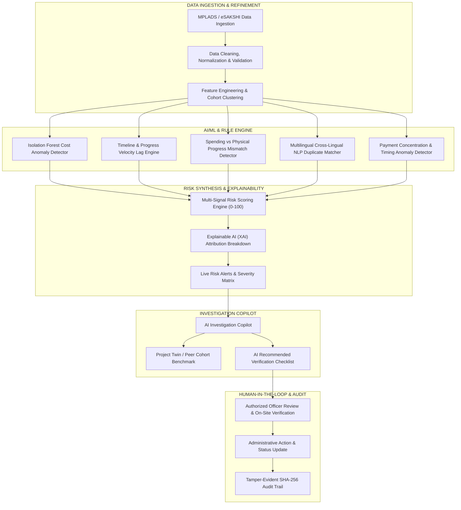

# Implementation Plan: VIKAS-DRISHTI (AI-Powered MPLADS Risk Intelligence & Monitoring System)

## Project Overview
**VIKAS-DRISHTI** (*Vikas Drishti - Development Vision & Oversight*) is an AI-powered risk-intelligence and monitoring layer designed for the **Members of Parliament Local Area Development Scheme (MPLADS)** ecosystem under the **Ministry of Statistics & Programme Implementation (MoSPI)** for Problem Statement **SIH26102**.

> [!IMPORTANT]
> **Complementary Architecture — Not a Replacement for eSAKSHI**:
> - **eSAKSHI**: Official administrative workflow engine for project sanctions, disbursements, and physical milestones.
> - **VIKAS-DRISHTI**: Intelligent analytical layer that inspects project metadata, financial disbursements, physical progress, and multilingual text to identify high-risk anomalies and prioritize them for verification.
> - **Fundamental Philosophy**: `Detect → Explain → Recommend → Verify → Track`.
> - **Strict Administrative Rule**: The AI **never** claims fraud or replaces human judgment. It flags "Risk signals", "Potential anomalies", and "Duplicate possibilities" with clear explainability, empowering authorized government officers to verify and act.

---

## User Review Required

> [!NOTE]
> All statistics, project IDs, and locations are generated as **Prototype Sample Data** for demonstration purposes and clearly labeled as such. The risk scoring thresholds (0–30 Low, 31–60 Medium, 61–80 High, 81–100 Critical) and weight distributions (Cost 25, Delay 20, Spending-Progress 20, Duplication 15, Unusual Patterns 20) are prototype configuration values that can be dynamically calibrated.

---

## System Architecture & Technical Flow

---

## Proposed Modules & Implementation Details

### 1. Backend Service & AI Engine (`server.py`, `ai_engine.py`, `data_store.py`)
- **Directory**: `C:\Users\ritik\.gemini\antigravity\scratch\vikas-drishti`
- **Zero-Dependency High-Performance Python Backend**: Built using Python 3.13 standard HTTP services with JSON API routing, ensuring instant startup, local persistence, and offline operability.
- **Machine Learning & Statistical Models**:
  - **Isolation Forest Cost Anomaly Model**: Unsupervised anomaly detector computing anomaly scores and cost deviation percentages relative to peer cohorts (same work type, geographic terrain, cost bracket).
  - **Multilingual NLP Duplicate Detector**: Handles English, Hindi (Devanagari script), and Romanized Hinglish/transliterations (e.g., matching *"Construction of Community Hall"* with *"Samudayik Bhawan Nirman"* or *"CC Road Nirman"* with *"Cement Concrete Road"*). Computes combined Semantic Similarity (cosine similarity over n-gram lemma matrices) + Spatial Proximity (GPS coordinates) + Time Window to flag `POTENTIAL DUPLICATE`.
  - **Spending-Progress Mismatch Engine**: Evaluates financial utilization vs physical progress curves. Identifies front-loaded disbursements with sluggish ground progress.
  - **Delay Engine**: Evaluates expected vs actual progress velocity and project duration overruns against peer benchmarks.
  - **Multi-Signal Calibrated Scorer**: Computes the composite 0–100 verification priority score:
    $$\text{Risk Score} = \text{Cost}(25) + \text{Delay}(20) + \text{SpendMismatch}(20) + \text{Duplicate}(15) + \text{UnusualPatterns}(20)$$
- **RESTful Endpoints**:
  - `GET /api/summary`: Top-level KPIs (Total: 12,458, Critical: 64, High: 98, Med: 62, Low: 24), active signals, compliance rate.
  - `GET /api/projects`: Paginated and filterable dataset of MPLADS projects with risk scores, peer comparisons, and anomalies.
  - `GET /api/projects/<id>`: Full dossier including financial breakdown, tranche records, peer cohort benchmarks, and AI copilot briefing.
  - `POST /api/analyze`: Live AI pipeline simulator allowing officers to input new project data and watch the pipeline execute in real time.
  - `POST /api/verify-step`: Interactive human verification checklist toggling (`[VERIFY]` $\rightarrow$ `[✓ COMPLETED]`).
  - `POST /api/action`: Officer administrative decision logging (Schedule Site Inspection, Issue Clarification Memo, Escalate to State Nodal, Resolve with Justification).
  - `GET /api/audit`: Tamper-evident audit log with SHA-256 integrity hashes and role stamps.
  - `GET /api/trends`: 6-month historical time series for anomaly patterns.

### 2. Frontend User Interface (`index.html`, `styles.css`, `app.js`)
- **Aesthetic**: MoSPI Government-Tech theme — Dark Navy (`#0B192C`), crisp white cards, Indigo/Purple AI indicators (`#6366F1`, `#8B5CF6`), and clear risk badges (Critical `#EF4444`, High `#F97316`, Medium `#F59E0B`, Low `#10B981`).
- **Interactive Views**:
  1. **Executive Dashboard**:
     - Key metrics banner with mandatory "Prototype Dashboard — Sample Data" clarification.
     - Live Risk Signals ticker with real-time anomaly alerts.
     - 6-Month Risk Trend analytics.
     - Interactive Leaflet.js Risk Map with glowing custom risk pins, popup summaries, and quick-investigate links.
     - High-Risk Projects Explorer with multi-parameter filtering (State, District, Category, Risk Tier).
  2. **AI Investigation Copilot (Signature Feature)**:
     - Flagship showcase project: `MP/SEH/CH/2024/10234` (*Construction of Community Hall, Pipaliya, Sehore, MP*).
     - Visual breakdown: Cost (22/25), Delay (18/20), Spending-Progress (17/20), Duplicate (15/15), Other Patterns (20/20) $\rightarrow$ **92/100 CRITICAL**.
     - AI Natural Language Explanation synthesized for administrative officers.
     - Interactive 5-point Verification Checklist with live toggle actions.
     - Administrative Action Console: Officer decision workflow, notice drafting, and printable/downloadable Official Verification Dossier.
  3. **Project Twin / Peer Cohort Comparison**:
     - Side-by-side benchmark card comparing current project (₹48.45L, 30% progress, 17 months) against similar peer cohort (₹19–23L, 75–85% progress, 9–11 months) with distribution curve and clear variance explanation.
  4. **Multilingual Duplicate Detection Center**:
     - Cross-lingual semantic matcher comparing English, Hindi, and Hinglish work descriptions.
     - Side-by-side geospatial and cost comparison.
  5. **Payment & Spending-Progress Intelligence**:
     - Tranche timeline showing fund releases vs actual ground physical progress.
     - High expenditure velocity front-loading alerts.
  6. **Compliance & Early Warning Center**:
     - Checklist: Sanction/Approval (✓), Payment Record (✓), Progress Update (✓), Completion Evidence (⚠), Nearby Project Comparison (⚠).
     - Early warning signals (e.g. 3-month cost escalation trends in specific sectors).
  7. **Interactive AI Sandbox / Ingestion Simulator**:
     - Live test bench for evaluators to test custom project parameters and observe the pipeline execute in real time.
  8. **Role-Based Access Control (RBAC) & Audit Trail**:
     - Role Switcher in header: District Officer, State Nodal Authority, MoSPI Admin Officer, MP / Authorized Viewer, System Administrator.
     - Immutable Audit Log with timestamps, officer IDs, and verification history.

---

## Verification Plan

### Automated Verification
1. **Model & Algorithm Verification**:
   - Run unit tests for Isolation Forest scoring, multilingual text normalizer, and duplicate similarity calculator.
2. **API Endpoint Verification**:
   - Test `GET /api/summary`, `GET /api/projects`, `GET /api/projects/MP_SEH_CH_2024_10234`, `POST /api/verify-step`, `POST /api/analyze`.
3. **Health Check**:
   - Validate HTTP server responds with status 200 and valid JSON headers.

### Manual Verification
1. Verify the Executive Dashboard renders smoothly with all stats, charts, and Leaflet risk map.
2. Switch between all 5 RBAC roles to ensure view permissions and badges adjust appropriately.
3. Open the **AI Investigation Copilot** for the flagship project `MP/SEH/CH/2024/10234` and verify:
   - 92/100 score breakdown is rendered accurately.
   - Project Twin shows the ₹48.45L vs ₹19–23L peer contrast.
   - Interactive verification checklist items update to `[✓ COMPLETED]`.
   - Administrative action logs a new entry into the Audit Trail.
4. Test the Multilingual Duplicate Detection feature with Hindi ("सामुदायिक भवन निर्माण") and English ("Community Hall").
5. Test the Interactive AI Ingestion Sandbox to verify live score calculation.
